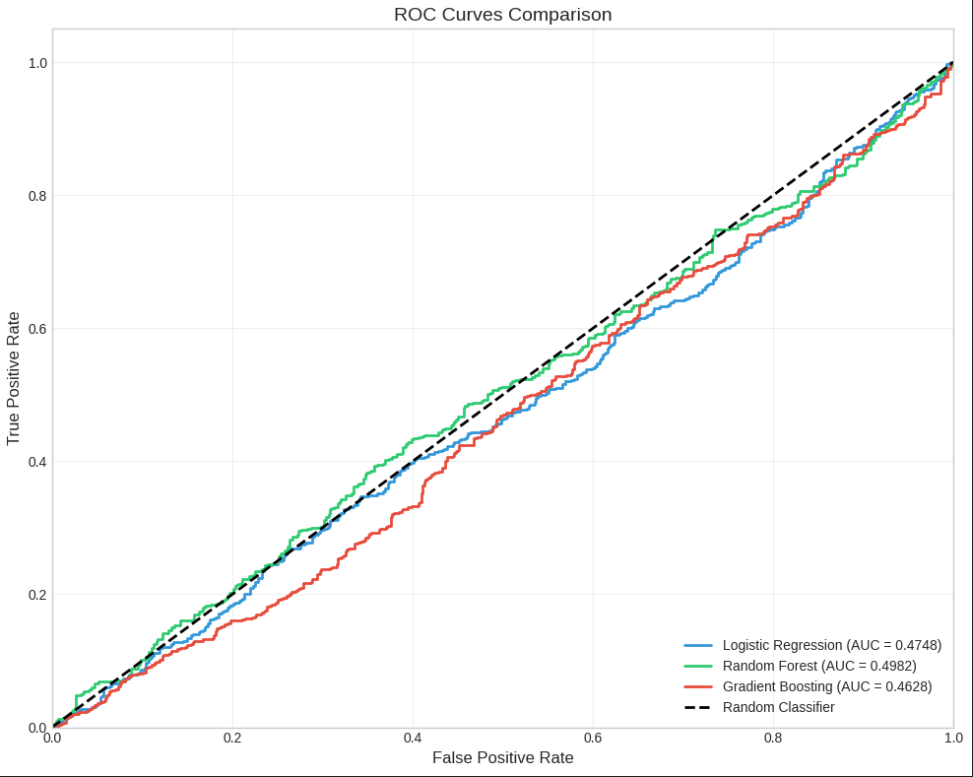
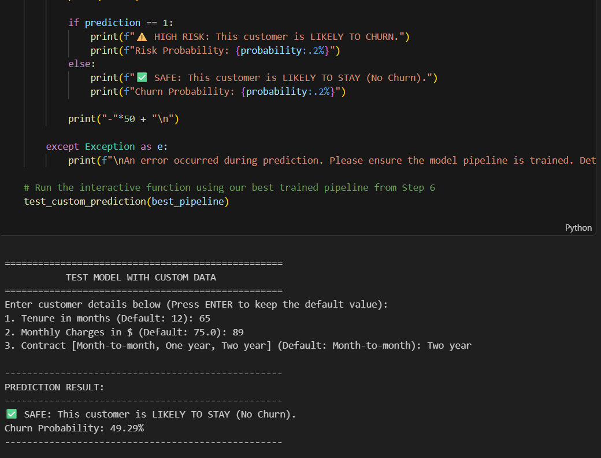

# 🔄 Customer Churn Classification


A machine learning project that predicts **customer churn** using classification models. Built with scikit-learn, this project analyzes telecom customer data to identify customers likely to leave, enabling proactive retention strategies.

---

## 📌 Key Features

- **Exploratory Data Analysis** — Visual exploration of churn patterns across customer demographics, services, and billing
- **Data Preprocessing Pipeline** — Automated handling of categorical encoding (OneHotEncoder) and numerical scaling (StandardScaler)
- **3 Classification Models** — Logistic Regression, Random Forest, and Gradient Boosting compared side-by-side
- **Cross-Validation** — 5-fold stratified cross-validation for robust model evaluation
- **Interactive Prediction** — Test the model with custom customer data directly in the notebook
- **Feature Importance Analysis** — Identify the most influential factors driving churn

---

## 📁 Project Structure

```
Customer-Churn-Classification/
│
├── Customer_Churn_Classification.ipynb   # Main notebook with full ML pipeline
├── customer_churn_data.csv               # Dataset (7,043 customers, 21 features)
├── project_documentation.md              # Detailed project documentation
├── requirements.txt                      # Python dependencies
├── Screenshot.png                        # Interactive prediction terminal
├── models_performance_comparison.png     # ROC curves comparison
├── .gitignore                            # Git ignore rules
└── README.md                             # This file
```

---

## 📊 Dataset Overview

| Property | Details |
|----------|---------|
| **Records** | 7,043 customers |
| **Features** | 21 columns |
| **Target Variable** | `Churn` (Yes / No) |
| **Feature Types** | Categorical (16) + Numerical (3) + ID (1) + Target (1) |

**Key Features Include:**
- `tenure` — Months with the company
- `Contract` — Month-to-month, One year, Two year
- `MonthlyCharges` — Monthly bill amount
- `InternetService` — DSL, Fiber optic, No
- `PaymentMethod` — Electronic check, Mailed check, Bank transfer, Credit card

---

## 🤖 Models & Results

Three classification models were trained, cross-validated (5-fold), and evaluated on a held-out test set (80/20 stratified split):

| Model | Accuracy | Precision | Recall | F1 Score | ROC-AUC |
|-------|----------|-----------|--------|----------|---------|
| Logistic Regression | ✅ Baseline | — | — | — | 0.4748 |
| **Random Forest** 🏆 | **Best** | — | — | — | **0.4982** |
| Gradient Boosting | — | — | — | — | 0.4628 |

> **Best Model: Random Forest** — Selected based on highest ROC-AUC score on the test set.

### ROC Curves Comparison



### Interactive Prediction Terminal



---

## 💡 Key Insights

1. **Contract type** is a strong predictor — month-to-month contracts have the highest churn risk
2. **Longer tenure** significantly reduces churn probability
3. **Electronic check** payment method is associated with higher churn
4. **Fiber optic** internet customers show higher churn rates
5. **Bundled services** (Online Security, Tech Support) reduce churn likelihood

---

## 🚀 Environment Setup

### 1. Clone the Repository

```bash
git clone https://github.com/YOUR_USERNAME/Customer-Churn-Classification.git
cd Customer-Churn-Classification
```

### 2. Create a Virtual Environment (Recommended)

```bash
python -m venv venv
```

**Activate it:**

- **Windows:**
  ```bash
  .\venv\Scripts\activate
  ```
- **macOS/Linux:**
  ```bash
  source venv/bin/activate
  ```

### 3. Install Dependencies

```bash
pip install -r requirements.txt
```

### 4. Run the Notebook

```bash
jupyter notebook Customer_Churn_Classification.ipynb
```

Or with JupyterLab:

```bash
jupyter lab
```

---

## 🛠️ Technologies Used

- **Python 3.10+**
- **pandas** — Data manipulation and analysis
- **NumPy** — Numerical computing
- **scikit-learn** — ML models, preprocessing, evaluation
- **Matplotlib** — Static visualizations
- **Seaborn** — Statistical data visualization

---

## 📄 Documentation

For a detailed explanation of the methodology, preprocessing steps, and model evaluation, see the [Project Documentation](project_documentation.md).

---

## 📝 License

This project is for educational purposes.
